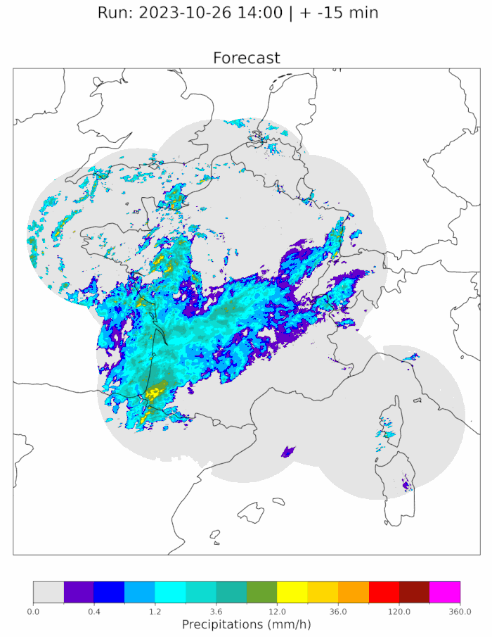

# Rainfall Nowcasting on France using DGMR model

This repository applies the pretrained Deep Generative Model of Rainfall (DGMR) developed by Google DeepMind to Meteo-France rainfall data. The goal of this project is to provide real-time high-quality short-term rainfall forecasts (nowcasting) on France.



## Table of Contents
- [Features](#features)
- [Installation](#installation)
- [Usage](#usage)
- [Data Sources](#data-sources)
- [Model Architecture](#model-architecture)

## Features
- Download radar data through Meteo-France public data API
- Short-term rainfall forecasting: max lead-time 2h, timestep 5min, resolution 1km
- Utilizes DGMR pretrained (UK data) model for realistic forecasts
- Visualizations of rainfall predictions with gifs

## Installation

### Clone the Repository

```bash
git clone https://github.com/meteofrance/dgmr
cd dgmr
```

### Install environment

With micromamba or conda:

```bash
micromamba create -f environment.yml
```

```bash
micromamba activate dgmr
```

### Create the API key on the Météo-France's portal

If you don't already have an account on the [Météo-France Public Data portal](https://portail-api.meteofrance.fr/web/en/), please create one.

1. Once connected, search to suscribe to the **Radar data** API (not the "Radar Package" one).

2. Then click on **Configure the API**

3. Select **API Key** as the token type, **enter the duration** (in seconds) and **Generate Token**.

4. **Copy the token**, you will need it in the next step.


### Set Up Environment Variables
Create a `.env` file in the root directory and add your configuration settings:
```plaintext
METEO_FRANCE_API_KEY="<your_meteo_france_api_key>"
METEO_FRANCE_DATA_PATH="<path_to_save_the_data_downloaded>"  # If empty downloaded data will be saved in ./data
```

### Download the pretrained model from Deepmind

Go to this [Google Cloud Storage](https://console.cloud.google.com/storage/browser/dm-nowcasting-example-data?pageState=(%22StorageObjectListTable%22:(%22f%22:%22%255B%255D%22))&project=friendly-retina-382415) link and download all the files and sub-folders in `dm-nowcasting-example-data/tfhub_snapshots/1536x1280` (this folder contains the pre-trained model with a size of 1536x1280).

## Usage

### Downloading data with Meteo-France's API

Simply run the script `./dgmr/download_data.sh` to download the latest radar images.

### Setting up a Cron Job for Automated Data Download

For real time forecasting, we need to download the radar data every 5 minutes.

To automate the data downloading process using a cron job, follow these steps:

1. Open your terminal and type `crontab -e` to edit the cron table.

2. Add a new line at the end of the file to define the cron job. The general syntax for a cron task is:
    ```bash
    */5 * * * * <ABSOLUTE_PATH_TO_REPO>/dgmr/download_data.sh
    ```

### Making forecasts

To make a real-time rainfall nowcast, just use :

```bash
python main.py
```

This scripts expects that you have already downloaded the 4 latest radar images.

It saves the forecast as a gif in the plot folder.

## Data Sources
This project uses rainfall data from [Meteo-France](https://donneespubliques.meteofrance.fr/).

The H5 files contain 5 min cumulated rainfall data over France, with a 500m resolution.

To match with the pretrained model inputs, we convert the data to instantaneous rainfall (mm/h) and downgrade the resolution to 1km.

## Model Architecture
The DGMR model is a state-of-the-art generative model designed for weather nowcasting. It leverages a combination of convolutional neural networks (CNNs) and generative adversarial networks (GANs) to produce high-resolution realistic rainfall forecasts.

For more details, please see [Ravuri, S., Lenc, K., Willson, M. et al. Skilful precipitation nowcasting using deep generative models of radar. Nature 597, 672–677 (2021)](https://doi.org/10.1038/s41586-021-03854-z).

A notebook is also availbale as a supplement to the article : [notebook](https://github.com/google-deepmind/deepmind-research/tree/master/nowcasting)


## Contributors

- From **Météo-France's AI Lab**: TOURNIER Théo & BERTHOMIER Léa
- From the French **National School of Meteorology**: CHAPELLE Flora, GERMAIN Hugo, LACOTTE Paul & PERELLO Ariadna
